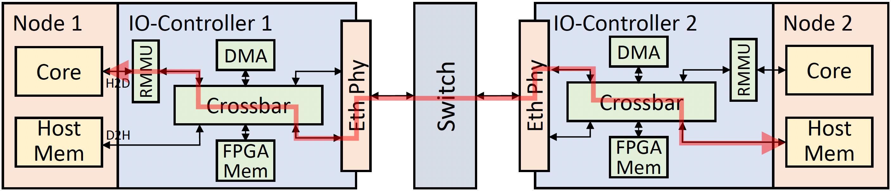
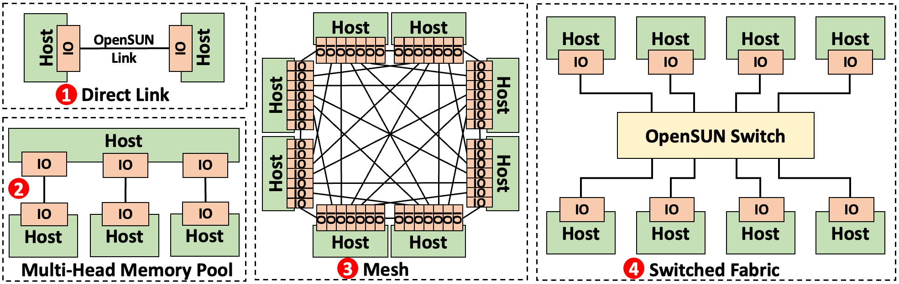

# OpenSUN: An Open Platform for Exploring Scale-Up Network Systems

**OpenSUN** is a high-performance, open-source testbed designed to accelerate community-driven exploration of Scale-Up interconnect systems. As Moore's Law slows down and the rise of AI workloads drives the need for resource disaggregation, Scale-Up architectures—where multiple nodes are interconnected via high-bandwidth links supporting direct Load/Store semantics—have become a critical area of research.

OpenSUN bridges the gap between proprietary industry solutions and academic research needs by providing a complete, hardware-based multi-node cluster platform. Built on commodity CPU servers and CXL-capable FPGAs (Intel Agilex 7), OpenSUN supports:

*   **Inter-node Synchronous Load/Store**: Enabling direct memory access across nodes.
*   **Asynchronous DMA Operations**: Efficient data movement offloading.
*   **Full-stack Architecture**: Encompassing IO-Die, switch, protocol stack, and software system design.
*   **Agile Prototyping**: User-friendly interfaces at each layer to facilitate hardware-software co-design and architecture exploration.

The figure below illustrates the path through which Node 1 accesses the memory of Node 2 via Load/Store semantics in the OpenSUN platform.

OpenSUN supports organizing multiple nodes into various topologies.

## Project Structure

This project is divided into three main components, covering hardware logic, kernel drivers, and userspace tools:

### 1. OpenSUN FPGA Hardware
The **OpenSUN-FPGA** project contains the core RTL implementation of the OpenSUN IO controller. Key components include:
*   **IO Controller Core (`afu2mc_wrapper`)**: The main logic integrating CXL, Ethernet, and DMA interfaces.
*   **AXI4 Crossbar**: A high-performance interconnect matrix for routing requests between the host CPU, remote nodes, and DMA engines.
*   **DMA Engine**: A programmable traffic generator for intensive memory access.
*   **Scale-Up Network Interface**: Ethernet-based transport logic for inter-node communication.

### 2. OpenSUN Driver/Kernel
The **OpenSUN-Driver** project provides the Linux kernel drivers required to operate the OpenSUN platform. Its main features include:
*   **Device Management**: Automatic probing and initialization of OpenSUN PCI devices.
*   **Dynamic NUMA Management**: Leveraging ConfigFS for memory hot-plug, allowing remote memory ranges to be dynamically exposed to the OS as local NUMA nodes.
*   **Register Access**: Exposing hardware configuration registers to userspace.

### 3. OpenSUN Tools
The **OpenSUN-Tools** project provides a set of userspace utilities and libraries for system management and application development:
*   **`opensunctl`**: A command-line utility for managing devices, configuring address mappings, allocating memory, and debugging hardware state.
*   **`opensunlib`**: A C development library that provides developers with concise APIs for building high-performance applications that interact with OpenSUN hardware (e.g., custom DMA operations, memory management).
